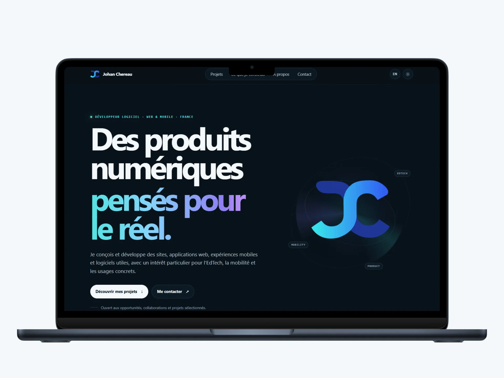
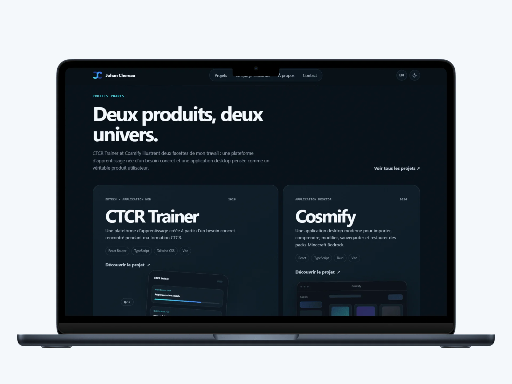
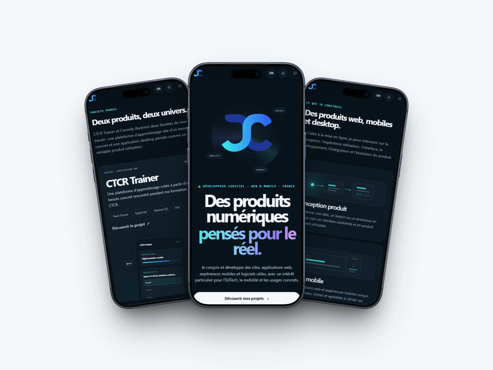

<div align="center">


# Johan Chereau — Portfolio

**Software, Web & Mobile Developer**

A modern bilingual portfolio focused on digital products, real-world use cases and selected work around EdTech, mobility and software development.

[Live website](https://johan-chereau.com) ·
[LinkedIn](https://www.linkedin.com/in/johan-chereau/) ·
[GitHub](https://github.com/JohanChereau)

<br />


</div>

---

## Overview

This repository contains my personal developer portfolio.

It was designed as more than a traditional résumé website: the goal is to present selected projects, product thinking and professional experience through a fast, accessible and visually polished experience.

The portfolio is available in **French and English**, with a strong focus on responsive design, accessibility, performance and SEO.

<p align="center">
  
</p>

## Featured work

The portfolio currently highlights two main projects:

### CTCR Trainer

An educational web application created from a real need encountered during professional transport training.

### Cosmify

A desktop application for managing and customizing Minecraft Bedrock skin packs, built around a modern product-oriented workflow.

<p align="center">
  
</p>

## Built for every screen

The interface was designed mobile-first while keeping the desktop experience equally polished.

<p align="center">
  
</p>

## Highlights

- French and English versions
- Responsive and mobile-first design
- Project case studies
- Dark and light themes
- Accessible interactions and reduced-motion support
- SEO, Open Graph and structured data
- Static generation with Astro
- Automatic deployment through Cloudflare
- Contact form powered by Web3Forms

## Stack

The portfolio is mainly built with **Astro, TypeScript and Tailwind CSS**, with MDX content collections for project case studies.

Interactive behavior is deliberately kept lightweight to preserve performance and accessibility.

## Performance

The production website currently reaches **100 / 100 / 100 / 100** on Lighthouse for:

- Performance
- Accessibility
- Best Practices
- SEO

## Development

```bash
pnpm install
pnpm dev
```

Create a local `.env` file if you want the contact form to work:

```env
PUBLIC_WEB3FORMS_KEY=
```

Production build:

```bash
pnpm build
```

## Deployment

The website is automatically built and deployed from GitHub using **Cloudflare Workers & Static Assets**.

Production:

**https://johan-chereau.com**

---

<div align="center">

Designed & developed by **Johan Chereau**

</div>
