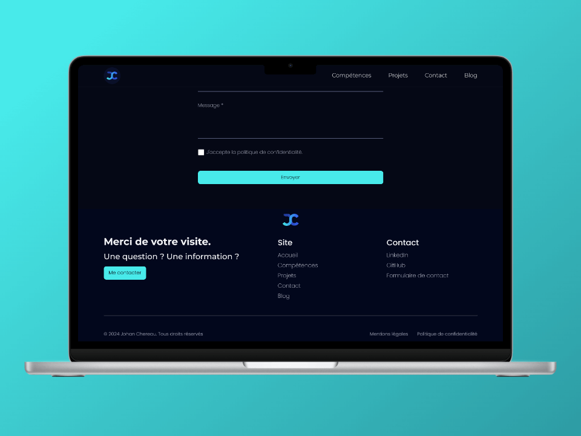

<h1 style="display: flex; gap: 1rem; flex-wrap: wrap;">Johan Chereau Portfolio</h1>

## Introduction

Welcome to my developer portfolio. This site contains all my social network links as well as all my contact details. The site also briefly presents the projects I've completed and the skills associated with them.

## Table of contents

- [Links](#links)
- [Social](#social)
- [Screenshots](#screenshots)
- [Technologies used](#technologies-used)
- [Lighthouse report](#lighthouse-report)
- [Licence](#licence)

## Links

- Live view of the website : [Click here](https://johan-chereau.com)

## Social

- **Portfolio** : [View portfolio](https://johan-chereau.com)
- **LinkedIn** : [View LinkedIn profile](https://fr.linkedin.com/in/johan-chereau)

## Screenshots

### Mobile view

### Tablet view

### Laptop views

## Technologies Used

- **HTML**: Used for structuring the content of the web pages.
- **CSS / SASS**: Used for styling and layout of the web pages.
- **JavaScript**: Used for adding interactivity and dynamic behavior to the website.
- **Figma**: Used for designing the user interface and creating mockups.
- **Lighthouse**: Used for testing the performance and accessibility of the website.

## Lighthouse report

## Licence

> MIT License
>
> Copyright (c) 2024 Johan Chereau
>
> Permission is hereby granted, free of charge, to any person obtaining a copy
> of this software and associated documentation files (the "Software"), to deal
> in the Software without restriction, including without limitation the rights
> to use, copy, modify, merge, publish, distribute, sublicense, and/or sell
> copies of the Software, and to permit persons to whom the Software is
> furnished to do so, subject to the following conditions:
>
> The above copyright notice and this permission notice shall be included in all
> copies or substantial portions of the Software.
>
> THE SOFTWARE IS PROVIDED "AS IS", WITHOUT WARRANTY OF ANY KIND, EXPRESS OR
> IMPLIED, INCLUDING BUT NOT LIMITED TO THE WARRANTIES OF MERCHANTABILITY,
> FITNESS FOR A PARTICULAR PURPOSE AND NONINFRINGEMENT. IN NO EVENT SHALL THE
> AUTHORS OR COPYRIGHT HOLDERS BE LIABLE FOR ANY CLAIM, DAMAGES OR OTHER
> LIABILITY, WHETHER IN AN ACTION OF CONTRACT, TORT OR OTHERWISE, ARISING FROM,
> OUT OF OR IN CONNECTION WITH THE SOFTWARE OR THE USE OR OTHER DEALINGS IN THE
> SOFTWARE.
